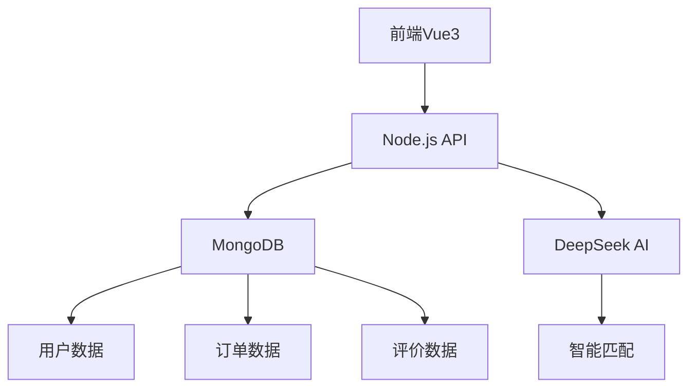

# 家政服务平台开发计划

## 一、技术架构


## 二、阶段开发任务

### 第一阶段：核心功能（2周）
1. **用户体系改造**
   - 扩展用户模型字段：
     ```typescript
     // backend/src/models/User.ts
     interface User {
       roles: ('client' | 'worker' | 'company' | 'trainer')[];
       profile: {
         skills: string[];
         certifications: string[];
         experience: number;
       };
     }
     ```
   - 增加角色中间件：
     ```typescript
     // backend/src/middleware/roleCheck.ts
     export const requireRole = (...roles: string[]) => {
       return (req: Request, res: Response, next: NextFunction) => {
         if (!roles.includes(req.user.role)) {
           return res.status(403).json({ error: '权限不足' });
         }
         next();
       };
     };
     ```

2. **资料批量上传**
   - 前端组件：
     ```vue
     // frontend/src/components/BatchUpload.vue
     <template>
       <el-upload
         action="/api/upload"
         :before-upload="checkFileType"
         multiple>
         <el-button type="primary">批量上传CSV</el-button>
       </el-upload>
     </template>
     ```
   - 后端处理：
     ```typescript
     // backend/src/routes/upload.ts
     router.post('/', upload.single('file'), async (req, res) => {
       const results = await processCSV(req.file.path);
       await User.insertMany(results);
     });
     ```

### 第二阶段：业务闭环（3周）
1. **智能匹配系统**
   - 算法流程：
   ```mermaid
   graph LR
     A[用户需求] --> B(特征提取)
     C[阿姨资料] --> B
     B --> D[DeepSeek模型]
     D --> E[匹配结果排序]
   ```

2. **在线签约**
   - 电子签名实现：
   ```javascript
   // frontend/src/utils/signature.js
   const captureSignature = () => {
     const canvas = ref(null);
     const ctx = canvas.getContext('2d');
     // 绘制签名逻辑
   };
   ```

## 三、数据库优化方案
1. 索引优化：
```javascript
// backend/src/models/User.ts
userSchema.index({ 'profile.skills': 1, 'profile.experience': -1 });
```

2. 连接池配置：
```typescript
// backend/src/config/database.ts
const conn = mongoose.createConnection(process.env.DB_URI, {
  maxPoolSize: 10,
  minPoolSize: 2
});
```

## 四、风险评估
1. 数据安全：需增加敏感字段加密
2. 性能瓶颈：建议增加Redis缓存层
3. 第三方依赖：DeepSeek API需做降级处理